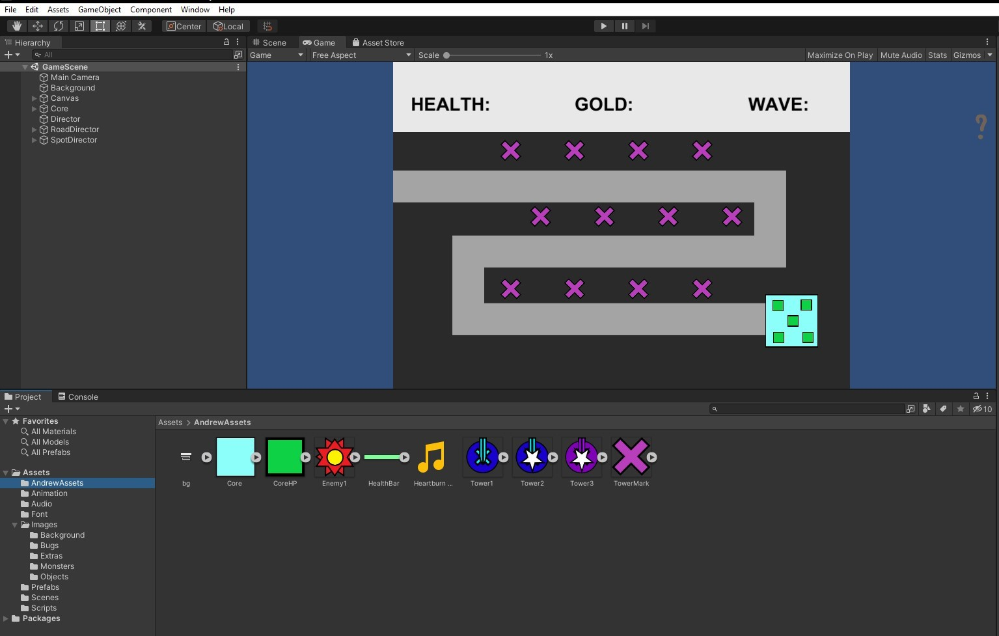

 
The original idea for my project was to be a Top down 2D tower defence game, and it has kept this wholy in nature along development. Getting the project to a testable stage took a long time however, with the focus on ASP.NET it was some time before I could 100% commit to JavaScript and then after that, Unity. With my game being a dynamic web application, using MVC as the logic for my game would be counter productive. The game needs to update and play in real time, not in a client / server request relationship. MVC would still be used, but later for identity and for storing the users score to a scoreboard that would be stored in Azure. At the time of my writing this, this functionality is not implemented yet however.  
 
The game originally was to be written in JavaScript, but with more research and pressure to get a product ready, I went with Unity instead, and took alot of time to focus and learn how the engine works.  
**2 Code and Architecture Review**  

