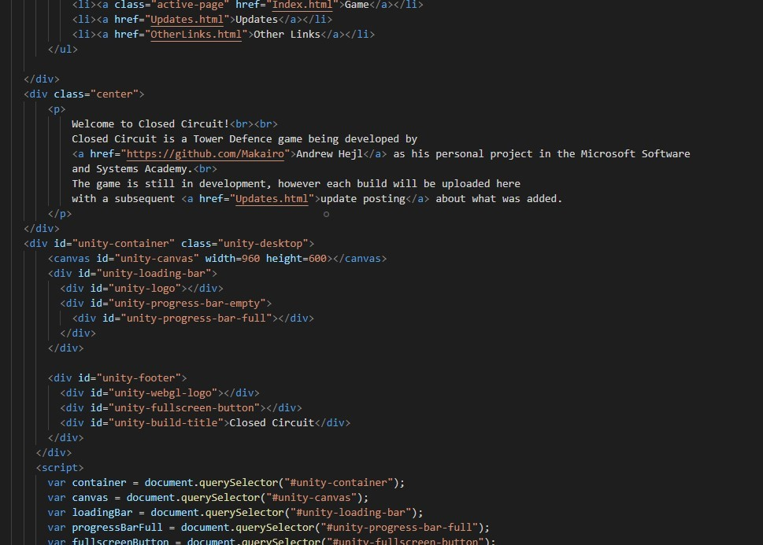

# Closed Circuit Review
**1 Project Experience** 
The original idea for my project was to be a Top down 2D tower defence game, and it has kept this wholy in nature along development. Getting the project to a testable stage took a long time however, with the focus on ASP.NET it was some time before I could 100% commit to JavaScript and then after that, Unity. With my game being a dynamic web application, using MVC as the logic for my game would be counter productive. The game needs to update and play in real time, not in a client / server request relationship. MVC would still be used, but later for identity and for storing the users score to a scoreboard that would be stored in Azure. At the time of my writing this, this functionality is not implemented yet however.  
 
**2 Code and Architecture Review**  
The base for my site is not yet written in ASP.NET, but instead just HTML. The reason for this was to practice more with HTML and CSS styling and also to test implementation of JavaScript and Unity scripts being hosted without anything else complicating it.
 
Unity Scripts themselves are written in C#, with the gameobjects and components being made and managed with the unity engine itself.
 
Here is a overview of my first scene as of this presentation.
 
 
**3 Product Demonstration** 
[Closed Circuit Game](https://closedcircuitgame.net/Index.html) 
**4 Lessons Learned** 
What did I do **RIGHT?**
- JavaScript to Unity decision
- HTML and JavaScript experimentation (helped with other projects!)
- Learning to manage a FTP server with domains.
- Pacing myself not to overload myself or burn out.
What did I do **WRONG?**
- Waiting too long to start work with Unity.
- ASP.NET attempt straight away with Unity scripts.
- Experimenting too much with hosting services.
Where was I **LUCKY?**
- Unity! Great engine and software.
- Other projects, this project turned into probably the LEAST developed honestly, but my other projects helped me learn more for this and kept me from burnout.
- My classmates, shoutout to Johnathan S, Brandon, Tim, and Gabriel for being awesome. Extra shoutouts for inspiration and support to Jonathan R, Wes, Darius, and Dantz.
What would I **CHANGE?**
- I'd definitely dive into Unity ALOT sooner, I'd have made alot more progress.
- At least one more attempt with ASP.NET implementation.
- One thing I wish I knew back when I started, was that even a small difference in requirements can alot to ALOT of time and work invested to make that happen. IE, keep my requirements simple, and don't bite off more than I can chew.

